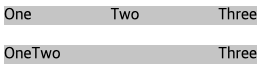

### CSS Tips

flexbox 사용시 제일 마지막 item만 제일 오른쪽에 위치하고 싶을 때 (아래 두번째 처럼) 중앙 item에 flex : 1 이라는 style을 추가하면 된다.



```css
div:nth-child(2) {
  flex: 1;
}
```

[이미지, 참고 출처](https://stackoverflow.com/questions/35269947/how-can-i-align-one-item-right-with-flexbox)

flex: 1 로 value 가 하나로 표현될 때는 `flex: <number> 1 0` 으로 number 값을 뜻한다. 가장 첫번째 자리는 flex-grow 값을 나타내고 이는 item의 메인 크기에서 얼마나 grow 할지 알려주는 값이다.

[MDN:flex-grow](https://developer.mozilla.org/en-US/docs/Web/CSS/flex-grow)
