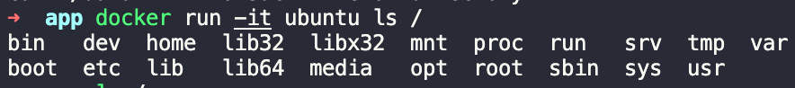

- docker container
- docker container image
- docker build && run
- 매번 다른 환경이 만들어짐? -> Volume으로 이를 해결
- bind mount
- docker compose

### Docker Container와 Container Image

> Container와 독립적인 File System

container는 host machine의 프로세스와는 다른 독립적인 프로세스이다(내 컴퓨터에서 돌아가는 가상환경이라고 생각하면 쉬울 듯). container는 자신만의 file system을 가지며 아래와 같이 구성되어있다.



컨테이너마다 이런 독립적인 파일시스템이 만들어지는데, 컨테이너 이미지라는 애가 제공해준다. 여기에는 해당 컨테이너에 필요한 dependencies, configuration 정보, 환경 변수 등 컨테이너를 실행시키기 위한 모든 정보들이 포함되어 있다.

> 그럼 이미지는 어떻게 만드나?

Dockerfile에는 이미지를 만들 때 필요한 base Image 정보나 필요한 폴더, command 등을 적혀있다. build 커맨드를 통해 이를 실행시키면 컨테이너 이미지가 빌드된다.
아래는 컨테이너 이미지를 만들기 위한 `Dockerfile`의 예시이다.

```zsh
# syntax=docker/dockerfile:1
FROM node:12-alpine
RUN apk add --no-cache python g++ make
WORKDIR /app
COPY . .
RUN yarn install --production
CMD ["node", "src/index.js"]


# docker image 만들기(빌드하기)
docker build -t getting-started .

# container 실행
docker run -dp 3000:3000 getting-started
```

https://medium.com/swlh/understand-dockerfile-dd11746ed183
https://docs.microsoft.com/ko-kr/dotnet/architecture/microservices/container-docker-introduction/docker-containers-images-registries

Image의 running Instance가 container임

docker-compose : - volumes: container의 usr/src/app과 현재 src를 연결 - environment: container에서의 환경 변수 세팅 - ports: 현재 api 9090 포트와 docker 8080 연결

### flags

```
docker run -d -p 80:80 docker/getting-started
```

- `-d` : detached mode(background)에서 container를 실행시킨다.
- `-p 80:80` : host의 80 포트와 container의 80 포트를 mapping 시킨다.
- `docker/getting-started`: 사용할 이미지

docker dashboard에는 현재 machine에서 돌아가고 있는 container들이 보여진다. container 안의 logs들은 container 내부 shell에 접근하여 얻을 수 있다.

### commands

```bash
# 새로운 컨테이너 이미지 만듦
docker build -t getting-started . # -t : 이미지의 새로운 이름 붙일 때 사용 , .는 build 커맨드가 끝남을 가리킴
# host의 3000 포트와 컨테이너의 3000포트를 매핑
docker run -dp 3000:3000 getting-started

# container id 알려면 docker ps
docker stop <id>
docker rm <id>
```

우리가 만든 이미지를 share할 수 있다 == 이미지만 공유한다면 우리가 사용하는 개발 환경을 그대로 다른 곳에서 실행시킬 수 있다.
같은 이미지를 사용하더라도 container는 각각 독립적인 환경이다.
새로 빌드 할 때 마다 데이터가 유지되지 않는데, host에서 db 파일이 유지되도록 만들어주면 그 다음 컨테이너에서 사용하는 할것
데이터가 저장될 directory에 볼륨을 만들고 attach 함으로써 (mounting이라고 표현) 데이터를 유지시킬 수 있다.

```bash
docker volume create todo-db # todo-db라는 volume을 생성
docker run -dp 3000:3000 todo-db:/etc/todos getting-started # container를 실행시칼 때, todo-db와 현재 db의 directory를 attach
docker volume inspect todo-db # 실제로 db 데이터가 저장되는 환경 알아보기
```

bind mount는 우리가 mountpoint를 직접 지정할 수 있다.
우리의 source code를 mount(볼륨 생성 -> attatch) 시키기 위해서 bind mount를 사용할 수 있다. 코드의 변화, response 등을 바로 확인할 수 있다.

container끼리 networking 할 수 있음 (Todo App - MySQL)

m1에 mysql image는 설치하지 못한다...후덜덜 -> 대신 mariaDB를 설치해서 해볼 수 있음

network를 통해서 현재 app이랑 외부의 DB와 연동시킬 수 있었다. 하지만 이렇게 네트워크를 만들어주고 컨테이너를 시작하고, 환경 변수
세팅하고 하는 등의 작업을 해야했다. 이걸 매번 기억하기도 어렵고, 다른 사람들과 공유하기도 어려워짐

docker compose!
우리가 필요한 환경 세팅 해주는 파일 docker-compose.yml

#### Volumns

Container volumes
With the previous experiment, we saw that each container starts from the image definition each time it starts. While containers can create, update, and delete files, those changes are lost when the container is removed and all changes are isolated to that container. With volumes, we can change all of this.

Volumes provide the ability to connect specific filesystem paths of the container back to the host machine. If a directory in the container is mounted, changes in that directory are also seen on the host machine. If we mount that same directory across container restarts, we’d see the same files.

There are two main types of volumes. We will eventually use both, but we will start with named volumes.

docker-compose up

compose file 안에 있는 named volume들은 docker-compose down 시 삭제되지 않는다. 삭제하고 싶으면 --volumns tag를 붙어여함

https://github.com/docker/getting-started/issues/124#issuecomment-782028688
