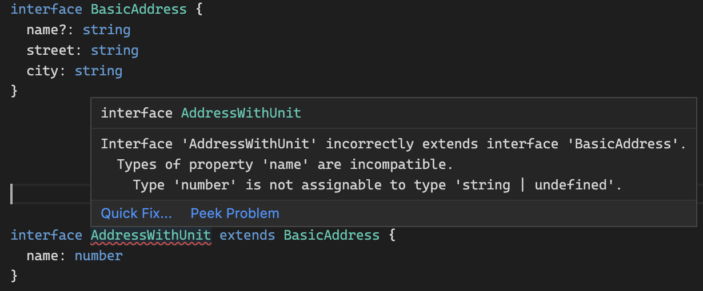

### extends

```ts
interface BasicAddress {
  name?: string
  street: string
  city: string
}
```

만약 특정 unit의 숫자가 추가된 AddressWithUnit이라는 타입이 필요하다면 아래와 같이 정의해줄 수 있다.

```ts
interface AddressWithUnit {
  name?: string
  street: string
  city: string
  unit: string // 추가
}
```

하지만 기존 BasicAddress 와 중복되는 property가 너무 많게 된다. `extends`를 사용해서 interface를 확장시켜서 중복을 줄여보자.

```ts
interface AddressWithUnit extends BasicAddress {
  unit: string
}
```

extends를 사용하면 named type으로 저장된 BasicAddress의 멤버들을 모두 복사해오고 새로운 프로퍼티를 추가할 수 있다.

여러 프로퍼티를 한꺼번에 확장시킬 수 도 있다.

```ts
interface Colorful {
  color: string
}

interface Circle {
  radius: number;
}

interface ColorfulCircle extends Colorful, Circle {}

const colorCircle: ColorfulCircle {
  color: 'blue',
  radius: 42
}
```

### Intersection

Intersection도 interface를 확장하는 방법 중 하나다.

👉 깨알 문법: [Type Aliases](https://www.typescriptlang.org/docs/handbook/advanced-types.html#type-aliases)

타입에 새로운 이름을 붙일 수 있다. interface 타입 뿐 아니라 primitive 값에도 이름을 붙일 수 있지만 이 방법은 딱히 사용하지 않는게 좋음.

extends와는 확장하고자하는 interface와 같은 프로퍼티를 다룰 때 conflicts를 해결하는 방법에서 좀 다르다.

extends는 기존 interface에 있는 프로퍼티를 추가할 수는 없다. 반면 intersection은 기존 프로퍼티를 추가했을 때 확장된 타입을 만들어 준다.

만약 extends를 사용해서 기존에 있던 프로퍼티를 추가하려하면 아래와 같은 에러가 뜬다.



[ ] TODO
intersection으로 확장했을 때,
