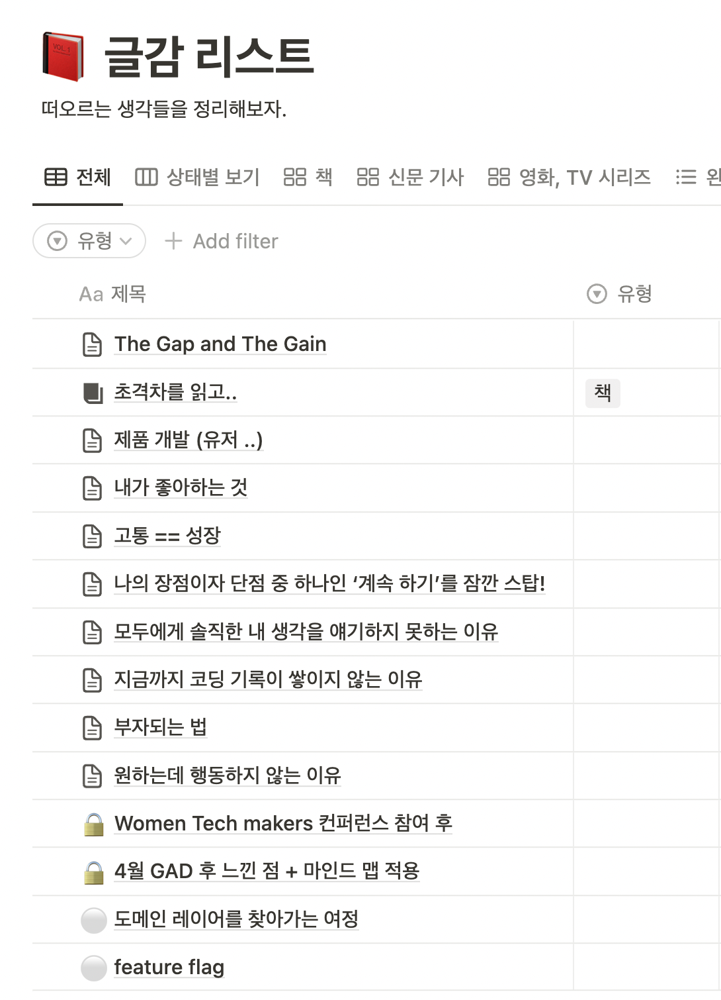

저는 새로운 사람들 만나는 걸 좋아하는 성격은 아니에요. 제가 어떻게 보여질지 고민하기도 하면서 이 사람과는 어떤 얘기를 해야하나 라고 고민하는 거 자체에 에너지를 많이 써서 그렇다고 생각합니다.
하지만 이런 환경에 익숙해지다보면 제가 안전하다고 느끼는 환경에서만 제 얘기를 편하게 말하게 될 거 같았어요. 요런 영역을 벗어나보는 연습을 자주 해봐야겠다는 생각이 들었습니다.

그래서 최근에는 의도적으로 새로운 사람들을 만나는 자리를 여러번 가졌는데요! 제가 주도적으로 말하는 미팅도 있었고 세일즈 미팅처럼 참여에 의의를 둔 미팅도 있었어요.

- 개발자 커피챗 ☕️
  어린 나이이신데도 불구하고 주도적으로 제품을 개발해오신 분을 만났어요. 시니어가 없는 환경에서 장기적으로 유지 보수가 가능한 코드를 만들기 위해서 끊임없이 노력하셨던 부분이 인상 깊었습니다.
  해야할 것들은 태산인데 요구는 끝이 없고, 어떻게 개발을 해야할지 모르는 상황 속에서 방법을 찾아내기 위해 많은 노력을 하셨다는 느낌을 받았어요. 저를 다시 되돌아보게 되는 커피챗이였습니다..!

- 제품 온보딩 미팅 👨‍🏫
  현재 저희 팀은 스타트업 대표님들이 현재의 회사 상황을 파악하고 미래를 설계할 수 있도록 도와주는 Financial Modeling 툴을 만들고 있는데요. 제공해드리는 Modeling 템플릿을 대표님과 같이 사용해보면서 실시간으로 피드백을 들어볼 수 있는 시간이였습니다.

* 제품 세일즈 미팅 💰
  제품의 pricing을 정하는 것도 '전략'! pricing 전략을 어떻게 하냐에 따라 제품의 브랜딩, 포지셔닝 등등을 다르게 할 수 있다는 걸 다시 한번 깨닫게 됐어요. 비즈니스는 결국 어떻게 설득 할 것인가에 초점이 맞춰져 있는거 같다고 생각이 들었습니다. 심리, 경제, 과학이 섞여있는 느낌.

온보딩 미팅, 세일즈 미팅에 참여하면서 좀 더 유저 입장에서 제품을 바라보게 됐던거 같아요. 실제로 제품을 개발하고 있는데도 불구하고 제품에 대해서 깊게 생각하지 않았던 거 아닌가 다시 한번 반성을 하게 됐습니다..!

다음주는 완전히 저의 comfort zone에 벗어나게 되는데요. 싱가포르로 출장을 가서 새로운 사람들을 왕창 만나고 올 거 같아요. (무려 구글 Singapore Office에도 방문)
설레면서도 사실 조금은 걱정 되는건 사실..(영어라도 잘했으면..ㅎㅎ) 하지만 또 새로운 환경에 부딫혀보면서 새롭게 배우는 것들이 많겠죠!

이 글도 빠르게 comfort zone에서 나오기 위해서 편하게 써봤어요. 수 많은 글들을 써놨는데 publish 를 하지 못하는 저를 위해! 첫 스타트로 요즘 하고 있는 노력들과 생각을 한번 기록해봤습니다.

(아직 세상으로 나오지 못한 생각들ㅎㅎ)
