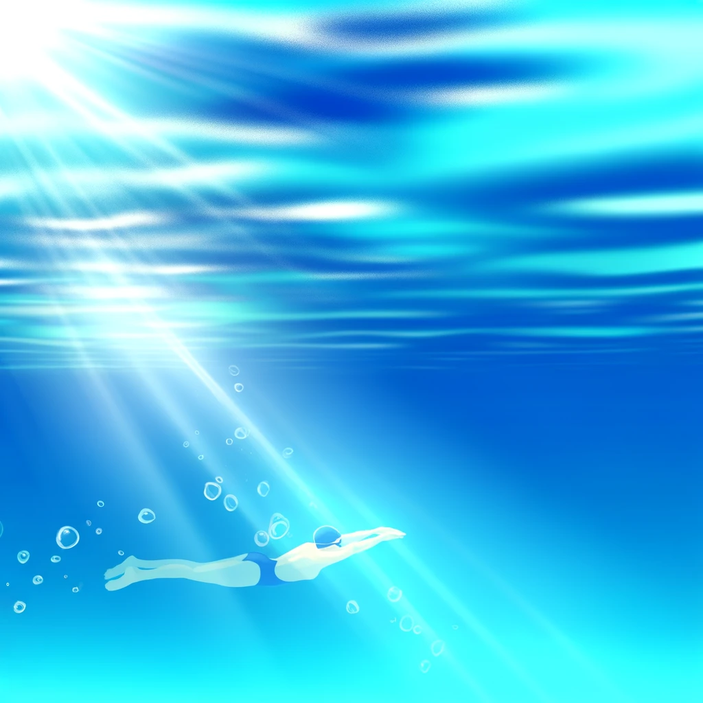

잘하고 싶은 분야가 있다면 혼자서 해내려 하기 보다 자주 피드백을 받을 수 있는 환경에 놓여야 더 빠르게 목표 지점까지 도달할 수 있다. 모든 피드백이 유의미하진 않지만 보통 스스로 인지하지 못하고 있는 부분을 빠르게 찾고 다음 단계로 나갈 수 있게 도와준다.

얼마 전 부터 수영을 배우기 시작했는데 3주차까지 팔 돌리기와 옆으로 숨쉬기 연습만 했다. 실력이 늘지 못하고 있어서 고민해보니 수업 방식과 강사의 피드백 방식에 문제가 있는 거 같았다.

20년만에 수영은 처음이라 자세가 여간 몸에 익지 않는데 강사는 자세를 어떻게 해야하는지 간단하게 알려주고는 훌쩍 다른 레인으로 강습을 하러 떠났다. 그렇게 25분을 수영하고 있었더니 어디선가 나타나서는 갑자기 호통을 치는게 아닌가. "백날 그렇게 하면 안 늘어요 여러분. 옆으로 돌 때는 고개만 돌리시면 안되고 어깨도 같이 돌리셔야죠. 지금 잘되는 사람이 아무도 없어요."

아니 진작 와서 얘기해주지. 25분 이면 대충 동작을 20번 정도 반복한 시점인데 피드백 주기가 너무 느리다는 생각을 했다. 옆에 붙어서 사람 마다 어떻게 해야하는지 자세를 잡아주지도 않으면서, 한참 뒤에 와서 한다는 말이 여전히 너무 못한다였다.

문제는 강사가 호통 치기 전까지 나는 꽤나 잘하고 있다고 생각했다는 거였다. 이번에 숨을 잘 못 쉰거 같으니 다음 차례 때는 고개를 더 돌려서 숨을 쉬어야겠다. 같이 어떻게든 셀프 피드백을 진행하며 매 차례마다 좀 더 나아지려고 노력했다. 하지만 강사는 내가 전혀 신경쓰지 못하고 있는 부분을 피드백 해줬고 그제서야 그 문제에 대해서 인식할 수 있었다.

자세가 잘못되었다는 걸 2번 반복 후에 피드백을 받았다면 더 빠르게 킥판을 졸업했을 수도 있지 않을까. 내 나름대로 고군분투하고 있었지만 엉뚱한 곳에서 문제점을 찾고 있었고 20번을 반복 후에 강사의 피드백을 받고나서야 내가 가진 문제를 고치기 시작했다.

피드백은 수영 뿐 아니라 모든 분야에 도움이 된다. 그 이유는 뇌 과학적으로 인간은 기존에 가지고 있었던 신념(심상모형)과 다른 무언가를 마주했을 때 이 정보를 받아드리면서 뇌가 변형되도록 설계 되어 있기 때문이다. 즉, 우리는 오류를 통해 무언가를 배우고 있는 것이다. 

생각했던 것보다 더디게 앞으로 나아가고 있다면, 적극적으로 주변에 피드백을 요청해서 빠르게 실패지점에 도달해보자. 고치고 개선하고 다시 깨져야 더 빨리 목표에 도달할 수 있다.

